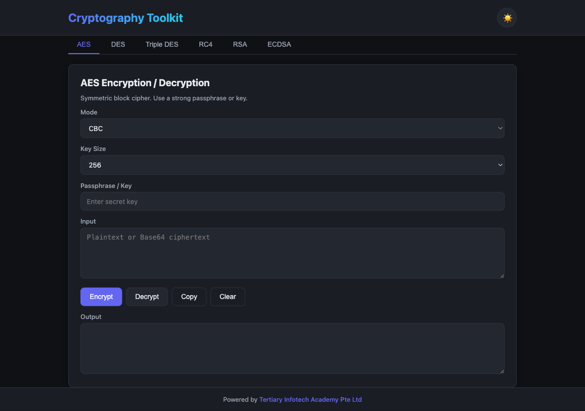

<div align="center">

# Cryptography Toolkit

[](https://developer.mozilla.org/docs/Web/HTML)
[](https://developer.mozilla.org/docs/Web/CSS)
[](https://developer.mozilla.org/docs/Web/JavaScript)
[](https://github.com/brix/crypto-js)
[](https://github.com/travist/jsencrypt)
[](https://alfredang.github.io/cryptography-toolkit/)
[](https://opensource.org/licenses/MIT)

**A modern, user-friendly web tool for classical and modern cryptographic operations.**

[Live Demo](https://alfredang.github.io/cryptography-toolkit/) · [Report Bug](https://github.com/alfredang/cryptography-toolkit/issues) · [Request Feature](https://github.com/alfredang/cryptography-toolkit/issues)

</div>

## Screenshot



## About

A clean, browser-based cryptography playground that lets you experiment with symmetric ciphers, asymmetric encryption, and digital signatures — all running locally in your browser. No data ever leaves your machine.

### Key Features

| Feature | Description |
|---------|-------------|
| **AES** | 128/192/256-bit with CBC, ECB, CFB, OFB, CTR modes and PBKDF2 key derivation |
| **DES** | Classic 64-bit DES (CBC, ECB, CFB, OFB) — educational use |
| **Triple DES** | 3DES with multiple block modes |
| **RC4** | Stream cipher implementation |
| **RSA** | 1024/2048/4096-bit key generation, encrypt/decrypt with PEM keys |
| **ECDSA** | Sign and verify messages on P-256, P-384, P-521 curves via Web Crypto API |
| **Dark / Light Theme** | Toggleable theme with preference saved to localStorage (defaults to dark) |
| **Zero Backend** | 100% client-side — your secrets never leave the browser |

## Tech Stack

| Layer | Technology |
|-------|------------|
| **Frontend** | HTML5, CSS3, Vanilla JavaScript |
| **Symmetric Crypto** | [CryptoJS](https://github.com/brix/crypto-js) 4.2.0 |
| **RSA** | [JSEncrypt](https://github.com/travist/jsencrypt) 3.3.2 |
| **ECDSA** | Native [Web Crypto API](https://developer.mozilla.org/docs/Web/API/Web_Crypto_API) |
| **Hosting** | GitHub Pages (via GitHub Actions) |

## Architecture

```
┌──────────────────────────────────────────────────────┐
│                    Browser (Client)                  │
│                                                      │
│  ┌────────────────────────────────────────────────┐  │
│  │           UI Layer (HTML + CSS)                │  │
│  │   Tabs · Forms · Theme toggle · Responsive     │  │
│  └────────────────────┬───────────────────────────┘  │
│                       │                              │
│  ┌────────────────────┴───────────────────────────┐  │
│  │         Crypto Controller (script.js)          │  │
│  └──┬───────────────┬───────────────┬─────────────┘  │
│     │               │               │                │
│  ┌──▼────────┐ ┌────▼───────┐ ┌─────▼────────────┐   │
│  │  CryptoJS │ │ JSEncrypt  │ │  Web Crypto API  │   │
│  │ AES · DES │ │    RSA     │ │      ECDSA       │   │
│  │ 3DES · RC4│ │            │ │                  │   │
│  └───────────┘ └────────────┘ └──────────────────┘   │
└──────────────────────────────────────────────────────┘
                  No network · No backend
```

## Project Structure

```
cryptography-toolkit/
├── index.html              # UI with tabs for each cipher
├── style.css               # Dark/light theme + responsive layout
├── script.js               # Crypto operations and theme/tab logic
├── screenshot.png          # README screenshot
├── .github/
│   └── workflows/
│       └── deploy.yml      # GitHub Pages deploy workflow
└── README.md
```

## Getting Started

### Prerequisites

Any modern browser (Chrome, Firefox, Safari, Edge).

### Run Locally

Option A — open directly:

```bash
git clone https://github.com/alfredang/cryptography-toolkit.git
cd cryptography-toolkit
open index.html
```

Option B — serve with a local web server (recommended):

```bash
python3 -m http.server 8000
# then open http://localhost:8000
```

## Deployment

This project auto-deploys to **GitHub Pages** on every push to `main` via the workflow in `.github/workflows/deploy.yml`.

To deploy your own fork:

1. Fork the repo
2. Go to **Settings → Pages** and set the source to **GitHub Actions**
3. Push to `main` — your site goes live at `https://<your-username>.github.io/cryptography-toolkit/`

## Usage Notes

- **AES output format**: `Base64(salt[8B] || iv[16B] || ciphertext)` — derived using PBKDF2 (1000 iterations)
- **DES / 3DES output**: `Base64(iv[8B] || ciphertext)` (or just ciphertext in ECB mode)
- **RSA**: Generate a key pair first; encrypt with public, decrypt with private (PKCS#1 v1.5)
- **ECDSA**: A signature algorithm (not encryption) — sign a message with the private key, verify with the public key

> **Educational notice**: DES and RC4 are cryptographically broken and included for learning purposes only. Use AES or RSA for real-world encryption needs.

## Contributing

Contributions are welcome.

1. Fork the project
2. Create a feature branch: `git checkout -b feature/amazing-feature`
3. Commit your changes: `git commit -m 'Add amazing feature'`
4. Push to the branch: `git push origin feature/amazing-feature`
5. Open a Pull Request

## License

Released under the MIT License.

## Developed By

**[Tertiary Infotech Academy Pte. Ltd.](https://www.tertiarycourses.com.sg/)**

## Acknowledgements

- [CryptoJS](https://github.com/brix/crypto-js) — symmetric cipher implementations
- [JSEncrypt](https://github.com/travist/jsencrypt) — RSA in JavaScript
- [emn178/online-tools](https://emn178.github.io/online-tools/) — UI inspiration
- The [Web Crypto API](https://developer.mozilla.org/docs/Web/API/Web_Crypto_API) for native ECDSA

---

<div align="center">

⭐ **If you find this useful, give it a star!**

</div>
